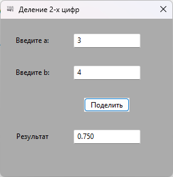
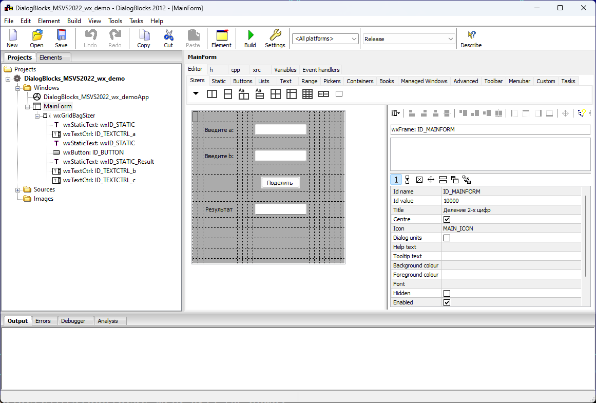

# DialogBlocks_MSVS2022_wx_demo
Пример программы на C++ с использованием wxWidgets и DialogBlocks в Visual Studio 2022






```
void MainForm::OnButtonClick(wxCommandEvent& event)
{
	double a, b; // входные данные
	wxTextCtrl* itemTextCtrl1 = (wxTextCtrl*)FindWindow(ID_TEXTCTRL_a); // находим компонент a по ID
	wxTextCtrl* itemTextCtrl2 = (wxTextCtrl*)FindWindow(ID_TEXTCTRL_b); // находим компонент b по ID
	wxTextCtrl* itemTextCtrl3 = (wxTextCtrl*)FindWindow(ID_TEXTCTRL_c); // находим компонент c по ID
	if (!itemTextCtrl1->GetValue().ToDouble(&a)) { // получаем значение из компонента a
		wxMessageBox(wxT("a is not a number")); // выводим сообщение об ошибке
		return; // выходим из функции
	}
	if (!itemTextCtrl2->GetValue().ToDouble(&b)) { // получаем значение из компонента b
		wxMessageBox(wxT("b is not a number")); // выводим сообщение об ошибке
		return; // выходим из функции
	}
	double c = a / b; // вычисляем результат
	if (isnan(c) || isinf(c)) { // проверяем результат на ошибки
		wxMessageBox(wxT("c is not a number")); // выводим сообщение об ошибке
		return; // выходим из функции
	}
	itemTextCtrl3->SetValue(wxString::Format(wxT("%0.3f"), c)); // выводим результат в компонент c
}
```
http://www.anthemion.co.uk/dialogblocks/

https://www.wxwidgets.org/

https://visualstudio.microsoft.com/ru/vs/community/